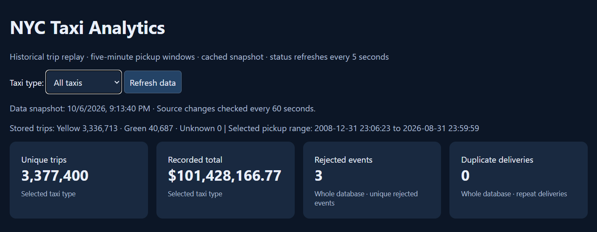
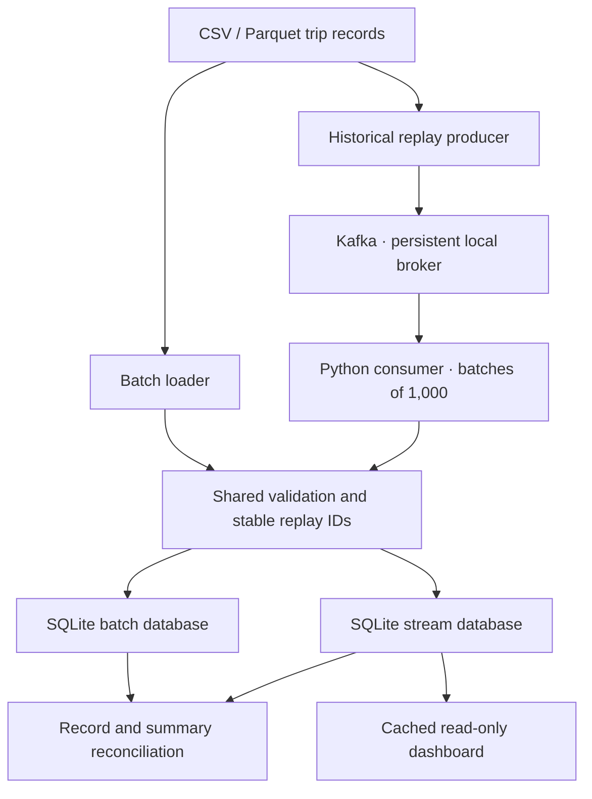

# NYC Taxi Batch and Streaming Pipeline

A Python data engineering project that processes yellow and green NYC taxi records
through batch loading and Kafka historical replay, stores validated trips in SQLite,
and reconciles the two paths record by record. A read-only dashboard displays trip
trends, pickup zones, payment types, and data-quality results.

**Verified full run: 3,377,403 source records → 3,377,400 accepted trips, 3 rejected
records, Kafka lag 0, and matching batch/stream trip records and five-minute summaries.**



The screenshot shows the all-date view before the month selector was added. The
current dashboard defaults to August 2026 and flags 29 accepted trips outside that
month; the full total remains available under **All source dates**.

## Architecture



Both loaders use the same validation. Accepted trips, rejected payloads, and delivery
metrics are stored transactionally. The consumer acknowledges Kafka offsets after
the database batch succeeds. The five-minute summary is a SQL view computed from
stored pickup timestamps; the dashboard builds a separate in-memory snapshot.

## What this project adds

- CSV and Parquet ingestion, including yellow `tpep_*` and green `lpep_*` timestamps.
- Stable SHA-256 replay IDs based on file contents and row position.
- Validation with a rejected-payload table and explicit reasons.
- Payment code `0` support and separate handling for missing payment values.
- Batched SQLite writes and manual Kafka offset commits after persistence.
- Duplicate and invalid-record injection for controlled demonstrations.
- Progress reporting, resumable consumption, and idempotent trip insertion.
- Full record and five-minute summary reconciliation.
- A cached dashboard with taxi/date filters, daily and five-minute trends, TLC zone
  labels, payment counts, and visible date-outlier handling.

The streaming input is a replay of completed historical trip records. The verified
implementation uses Python and SQLite locally. Optional BigQuery snapshot export
and a Mage adapter are included but were not validated as part of the full local
run. Spark, Debezium, and MinIO are future extensions.

## Measured results

Results below were observed on the author's local Windows environment on 6 October
2026. Generated databases and the large yellow input are excluded. The green Parquet file
was uploaded at the repository root and can be copied into `data/` for the documented commands.

| Measure | Result |
| --- | ---: |
| Yellow source file rows | 3,336,716 |
| Green source file rows | 40,687 |
| Total source rows | 3,377,403 |
| Accepted yellow trips | 3,336,713 |
| Accepted green trips | 40,687 |
| Accepted trips, all source dates | 3,377,400 |
| Rejected records: dropoff before pickup | 3 |
| Accepted trips outside August 2026 | 29 |
| Accepted trips in August 2026 | 3,377,371 |
| Missing payment values retained | 6,313 |
| Flex Fare payment code 0 records | 921,180 |
| Final Kafka consumer lag | 0 |
| Batch/stream reconciliation | PASS |

Payment validation initially excluded code 0. Its rejected payloads were recovered
using the corrected normalization, and a fresh Kafka replay reproduced the corrected
batch results. Out-of-month dates are retained and flagged rather than silently
rewritten. See [validation evidence](docs/validation.md).

## Quick start: synthetic batch demo

Clone this repository, then use Python 3.11 or 3.12. The bundled `data/sample.csv` is a 120-row synthetic fixture.
It demonstrates execution without downloading millions of records.

Windows PowerShell:

```powershell
git clone https://github.com/quyenmcu/nyc-taxi-batch-streaming-pipeline.git
cd nyc-taxi-batch-streaming-pipeline
python -m venv .venv
.\.venv\Scripts\Activate.ps1
python -m pip install -r requirements.txt
python pipeline.py batch --input data/sample.csv --db output/demo-batch.db
python dashboard.py --db output/demo-batch.db --month 2016-06
```

Open http://localhost:8080. Expect **120 unique trips**. If PowerShell activation is
blocked, invoke `.\.venv\Scripts\python.exe` directly in place of `python`.

macOS/Linux: activate with `source .venv/bin/activate` after `python3 -m venv .venv`,
then run the same Python commands.

## Kafka demo and reconciliation

Docker Desktop must be running with Linux containers on Windows. If an older
project is already using port 9092, stop its containers from that project folder
with `docker compose down` before starting this setup; its named volume is retained. Kafka runs in Docker;
Python runs on the host. The Compose setup includes a one-time volume ownership service
for the broker's UID 1000.

```powershell
docker compose up -d --wait
```

Terminal 1:

```powershell
python pipeline.py consume --topic taxi.demo.v1 --group taxi-demo-v1 --db output/demo-stream.db
```

Terminal 2:

```powershell
python pipeline.py produce --input data/sample.csv --topic taxi.demo.v1 --interval 0
```

Check the group in Terminal 2:

```powershell
docker compose exec kafka /opt/kafka/bin/kafka-consumer-groups.sh --bootstrap-server localhost:9092 --describe --group taxi-demo-v1
```

After the producer reports delivery success and the group reaches lag 0, stop the
consumer with Ctrl+C and compare:

```powershell
python reconcile.py --batch output/demo-batch.db --stream output/demo-stream.db
```

Expected: `PASS: trip records and five-minute summaries match`.
Use a fresh topic, group, and database for an independent experiment. To resume an
interrupted consumer, reuse its group **and** database. An already committed group
paired with an empty database would skip previous records.

## Full yellow and green replay

Obtain records from the [NYC TLC trip record data page](https://www.nyc.gov/site/tlc/about/tlc-trip-record-data.page).
The verified run used local files named `yellow_tripdata_2026-08.parquet` and
`green_tripdata_2026-08.parquet`. Put your files in `data/`. The existing root-level green file can be copied with
`Copy-Item green_tripdata_2026-08.parquet data/` in PowerShell. Use the same exact files
on both the batch and replay paths; IDs depend on their bytes.

```powershell
python pipeline.py batch --input data/yellow_tripdata_2026-08.parquet --db output/batch-full-202608.db
python pipeline.py batch --input data/green_tripdata_2026-08.parquet --db output/batch-full-202608.db
```

For the Kafka terminals, lag check, and full-run reconciliation, see
[full replay instructions](docs/full-replay.md). Those instructions retain the
original verified baseline filename `batch-green-full-v2.db`; substitute your
`batch-full-202608.db` when reproducing a new run.

Start the full dashboard:

```powershell
python dashboard.py --db output/stream-full-202608.db --month 2026-08
```

The initial scan runs in the background and may take over a minute on the full
local database. Requests then use cached results. Changes are checked every 60
seconds, and **Refresh data** requests a fresh snapshot. See [dashboard details](docs/dashboard.md).

## Demonstrate duplicate protection

After a clean full run, restart its consumer with the same group and stream database.
Replay only the first 1,000 rows of the unchanged yellow file:

```powershell
python pipeline.py produce --input data/yellow_tripdata_2026-08.parquet --topic taxi.full-202608-v1 --limit 1000 --interval 0
```

Expected: duplicate delivery metrics increase, while unique trips stay at
**3,377,400** and reconciliation still passes. This is a reproducible test procedure;
the included full-run screenshots show zero duplicate deliveries before this test.

## Optional cloud and Mage adapters

`bigquery_export.py` performs a manual snapshot-to-staging upload and inserts missing
trip IDs into BigQuery using MERGE. It is separate from the Kafka consumer and was
not part of the verified local run. Install `requirements-cloud.txt`, authenticate
using your own Application Default Credentials, and see [adapter instructions](docs/optional-adapters.md).

`rebuild_batch.py` is a Mage custom-block adapter. It requires Mage to be installed
separately and `pipeline.py` to be importable. No packaged Mage service is included.

## Tests

```powershell
python -m unittest discover -s tests -v
```

Tests cover normalization, malformed messages, transaction rollback, partition
acknowledgments, safe replay after a simulated Kafka commit failure, CSV/Parquet
identity, dashboard snapshots, month boundaries, and reconciliation. CI runs Python
tests on 3.11 and 3.12. Offline mocks complement the measured local Kafka run; the
CI job does not start Docker or replay the full dataset.

## Design limits

- Delivery is at least once; storage is idempotent for these replay IDs. This is not
  an end-to-end exactly-once claim.
- File hash plus row position identifies a replay record, not a TLC-issued trip ID.
  Editing/reordering a file changes IDs; cross-file business deduplication is absent.
- Pickup timestamps retain NYC local wall time. There is no watermark or finalized
  event-time window policy. Late records revise query results.
- Monetary totals use floating point and preserve negative source amounts. They are
  recorded totals, not profit or accounting-grade decimal calculations.
- A single local Kafka broker and SQLite sink demonstrate correctness and recovery;
  they are not a highly available production deployment.
- The dashboard snapshot is rebuilt by scanning accepted records. It caches queries
  but does not incrementally maintain warehouse aggregates.

## References and credits

This project began with [Darshil Parmar's Uber ETL tutorial](https://github.com/darshilparmar/uber-etl-pipeline-data-engineering-project)
and used [Nguyen's NYC Taxi Data Pipeline](https://github.com/trannhatnguyen2/NYC_Taxi_Data_Pipeline)
as a streaming reference. The local replay, validation, storage, reconciliation,
and dashboard code here were independently developed with AI assistance. Upstream
implementation files are linked rather than redistributed.

Data and zone definitions come from NYC TLC. See [provenance](docs/provenance.md)
for source links and the implemented scope.

Author: **Mac Chan Quyen** · [GitHub](https://github.com/quyenmcu)
