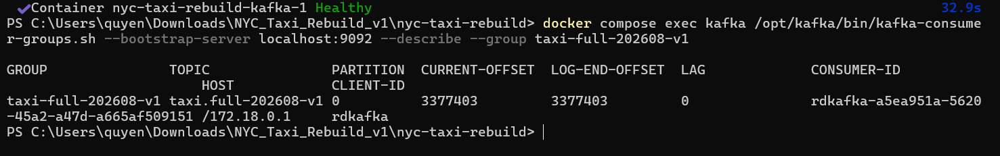
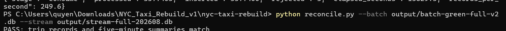
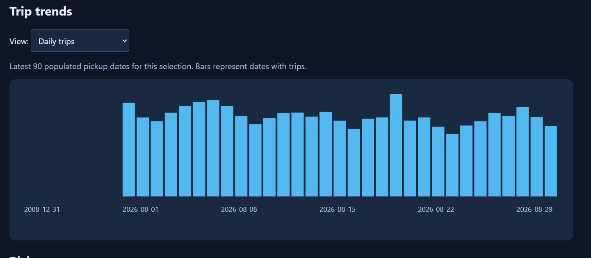
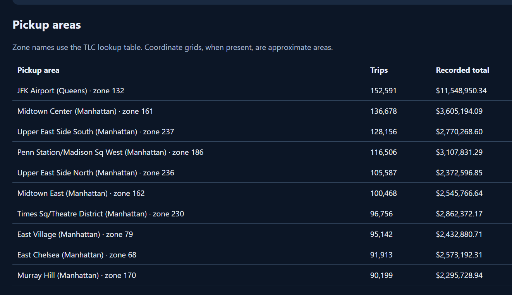
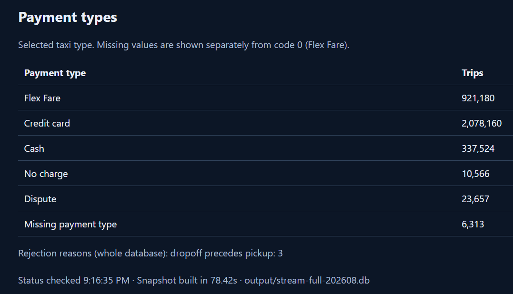

# Validation evidence

The author's local Windows run processed the full yellow/green files and reported:

```text
Total trips: 3377400
Remaining rejection reasons: [('dropoff precedes pickup', 3)]
Kafka current offset: 3377403
Kafka log-end offset: 3377403
Kafka lag: 0
PASS: trip records and five-minute summaries match
Trips outside August 2026: 29
```





The overview and trend screenshots predate the final August-only selector. They show
all source dates, including the 2008 pickup outlier. The current dashboard retains
those records but defaults to August-only analytics and reports the outlier count.
This does not change the underlying reconciled databases.







The initial full dashboard snapshot took **78.42 seconds** on the author's machine.
The consumer's displayed average rate after completion includes hours of idle time,
so it is not used as an active throughput benchmark.

The new repository packaging includes volume ownership initialization and read-only
reconciliation connections. These are locally inspected/offline-tested changes;
the new Compose initialization service still needs a fresh-container smoke test.

The standalone duplicate-replay and stop/restart demonstration should be recorded
separately. Offline tests simulate crash/commit-failure paths, but the screenshots
above do not establish every possible recovery scenario.

## Repository checks

All **17 automated tests passed** against the uploaded pipeline/dashboard, including
real Parquet ingestion with the pinned requirements. Python compilation, JavaScript
syntax, and local documentation-link checks also passed. GitHub Actions runs the
same suite on Python 3.11 and 3.12.
